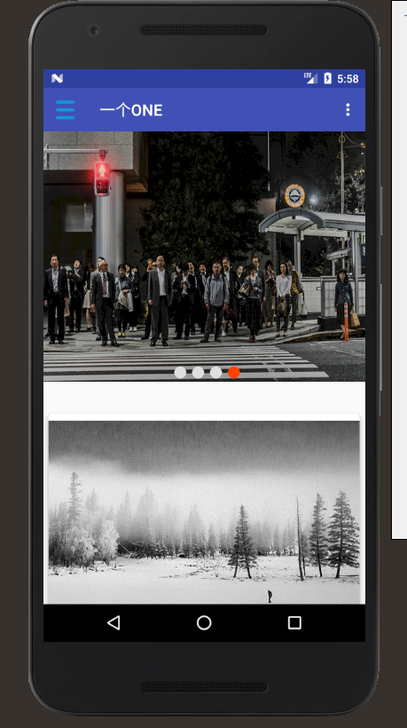

##ONE
 
####基础功能

- **阅读、音乐、影视Listview展示** ：采用滑动菜单，选择阅读、音乐、影视列表界面
- **首页**：展示轮播图和当天的插画，文章。
- **列表界面中** ：一开始只展示10个item，列表支持下拉刷新，上拉加载更多
- **内容详情** ：使用TextView展示Html，可以查看内容，作者，评论。
- **插画的轮播图展示** ：首页中的轮播图可以看到最近三天的插画。
- **本地缓存** ：使用文件缓存和LruCache，缓存后，断网了也可以查看。

####使用
**网络请求使用HttpUrlConnection**
**列表控件ListView，adapter**
**文件缓存**
**使用TextView展示Html**
**MyViewPager + LooperPagerAdapter**
**自定义控件LoadMoreListView**
**使用了Material Design设计**

##首页

##列表界面

-------------------

